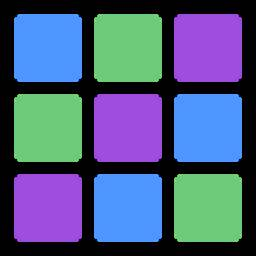
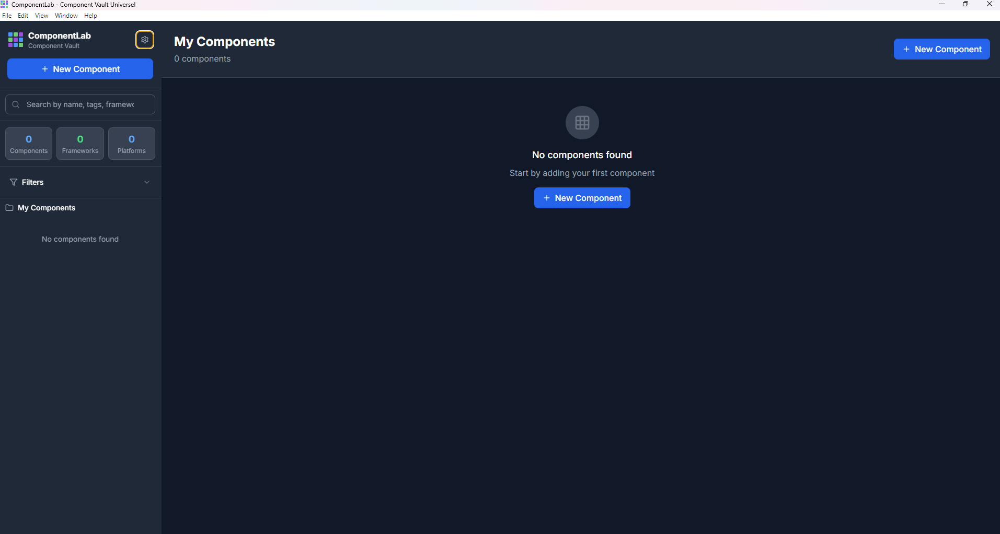
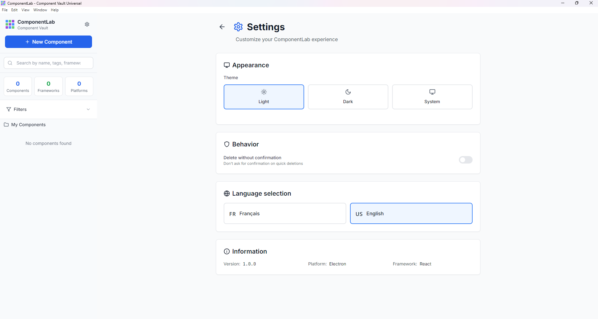
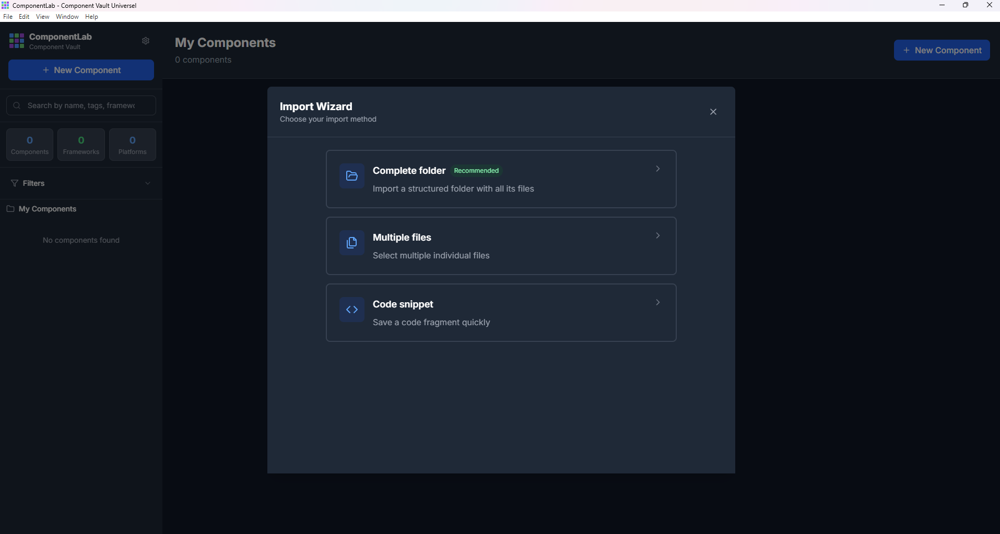
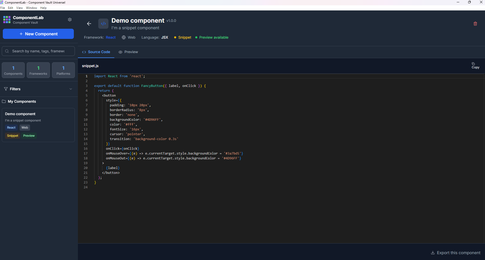

# ComponentLab 🧩



**Universal Component Vault for developers**  
*Store, organize and reuse your multi-framework UI components*

[](https://github.com/Pouiks/ComponentLab/releases)  
[](https://github.com/Pouiks/ComponentLab/releases)  
[](LICENSE)

[📥 Download](https://github.com/Pouiks/ComponentLab/releases/latest) • [🐛 Report an issue](https://github.com/Pouiks/ComponentLab/issues) • [💬 Discussions](https://github.com/Pouiks/ComponentLab/discussions)

---

## 🎯 About

**ComponentLab** is a desktop app that helps developers manage their UI components more efficiently.  
Stop wasting time hunting for that perfect button or CSS animation across your old projects!

---

### ✨ Why ComponentLab?

- 🏗️ **Multi-framework**: React, Vue, Angular, Flutter, HTML/CSS, Web Components...
- 🔍 **Smart search**: Find your components in seconds
- 📁 **Flexible import**: Full folders, multiple files, or simple snippets
- 🌍 **Bilingual UI**: English and French
- 🌙 **Dark mode**: Comfortable for long coding sessions
- 📝 **Built-in documentation**: Every component with its own doc and examples

---

## 🚀 Features

### 📦 Component management

- Advanced import: 4 import methods (full folder, multiple files, snippet, external styles)
- Auto-detection: Detect framework and language automatically
- Preview: Syntax-highlighted preview (Monaco Editor)
- Full metadata: Name, description, tags, version, author...

### 🔎 Search & organization

- Text search: Across name, description, tags
- Advanced filters: By framework, language, type
- List / grid view: Organize as you like
- Intuitive navigation: Clean and responsive interface

### 🛠️ Developer-friendly

- Built-in editor: Monaco Editor with multi-language support
- Auto-save: Real-time saving of your edits
- Safe delete: Confirmation before deleting
- Local storage: Your components stay on your machine

---

## 🖼️ Screenshots

### Main interface


### Light mode


### Component import


### Code editor


---

## 📥 Installation

### Windows

1. **Download** the latest version from the [Releases page](https://github.com/Pouiks/ComponentLab/releases/latest)
2. **Run** `ComponentLab.Setup.x.x.x.exe`
3. **Follow** the installer

⚠️ **Important note**: Windows may show a SmartScreen warning because the app is not digitally signed.  
Click "More info" then "Run anyway" — ComponentLab is perfectly safe!

---

### macOS & Linux

*Versions coming soon — Contributions welcome!*

---

## 🎮 Usage

### First launch

1. Launch ComponentLab from your Start menu
2. Explore the interface with example components
3. Add your first component with the "+ Add component" button

### Adding a component

1. Click the "+" button in the sidebar
2. Choose your import method:
   - Full folder: Import a component with all its files
   - Multiple files: Select multiple related files
   - Code snippet: Paste code directly
   - External styles: Reference external CSS files
3. Fill in the metadata (name, description, tags, etc.)
4. Save — and you're done!

### Organizing your components

- Search with the search bar
- Filter by framework or language
- Sort by name, creation date, or last update
- Delete obsolete components (with confirmation)

---

## 🔧 Configuration

### File structure

ComponentLab stores your components in:

my_components/
├── React/
│ ├── Button/
│ │ ├── index.jsx
│ │ ├── styles.css
│ │ └── meta.json
│ └── Modal/
│ ├── index.jsx
│ └── meta.json
├── Vue/
├── Angular/
└── ...

pgsql
Copier
Modifier

### Meta.json format

```json
{
  "id": "button-primary",
  "name": "Primary Button",
  "description": "Primary button with animations",
  "framework": "React",
  "language": "JSX",
  "tags": ["button", "primary", "interactive"],
  "version": "1.0.0",
  "author": "Your Name",
  "created_at": "2024-01-01T00:00:00.000Z",
  "updated_at": "2024-01-01T00:00:00.000Z"
}


🛠️ # Development
**Prerequisites**
Node.js 18+

npm or yarn

Local installation
bash
Copier
Modifier
# Clone the repo
git clone https://github.com/Pouiks/ComponentLab.git
cd ComponentLab

# Install dependencies
npm install

## Run in development mode
npm run dev
Available scripts
bash
Copier
Modifier
npm run dev            # Development with hot-reload
npm run build          # Production build
npm run build:electron # Build and package Electron app
npm run lint           # Lint the code
npm run lint:fix       # Auto-fix lint errors


##**Tech stack**
Frontend: React 18 + Vite

Desktop: Electron 28

Styling: TailwindCSS

Editor: Monaco Editor

Icons: Lucide React

i18n: react-i18next

🤝 ##**Contributing**
Contributions are welcome!

##**How to contribute**
Fork the project

Create a feature branch (git checkout -b feature/AmazingFeature)

Commit your changes (git commit -m 'Add some AmazingFeature')

Push to the branch (git push origin feature/AmazingFeature)

Open a Pull Request

##**Contribution ideas**
 macOS and Linux support

 Optional cloud sync

 IDE plugins (VS Code, WebStorm, etc.)

 Export to different formats

 Custom themes

 REST API for integrations

🐛** Known issues**
Windows SmartScreen: Normal warning for unsigned apps

Icons: Currently using Electron default icon
**
📋 Roadmap**
 v1.1: macOS and Linux support

 v1.2: IDE plugins

 v1.3: Cloud sync

 v2.0: Team collaboration mode

💬 Support
🐛 GitHub Issues
💭 GitHub Discussions
⭐ Acknowledgements

Thanks to all contributors

Inspired by real-world developer needs

⭐ If ComponentLab is useful to you, please give the project a star!
